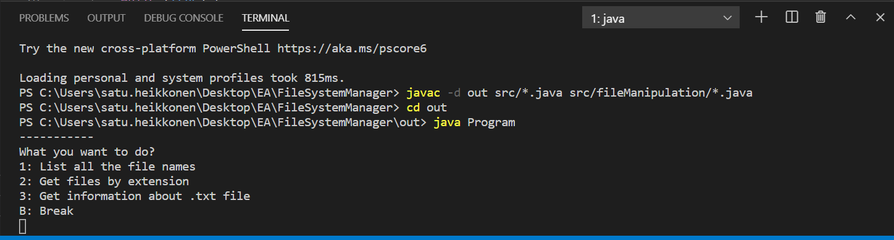
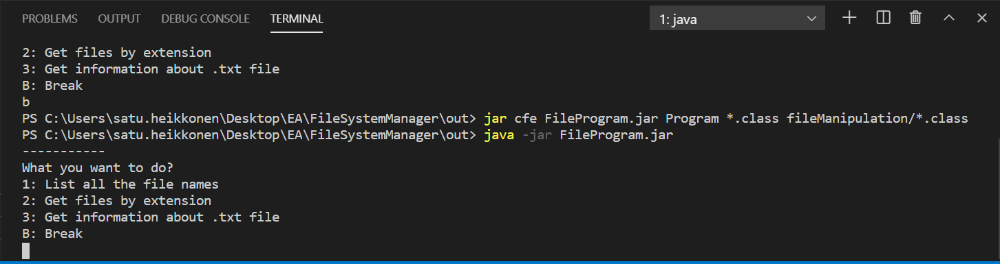

# File system manager

Java console application which gathers information about the files in the project folder. Project includes logging service which logs all activies to logging file with timestamp and duration of the function calls. Project has compiled without IDE.

### Functionality

1. Prints all file names

2. Searches files by their extension

3. Searches .txt file by name

4. Gets data from searched file
    - Full file name
    - Size of the file
    - Lines in the file
    - Searches entered word from the file

### Compailing

The command which compiled .java files into .class files in 'out' folder.

The commands which created .jar file and run it.

